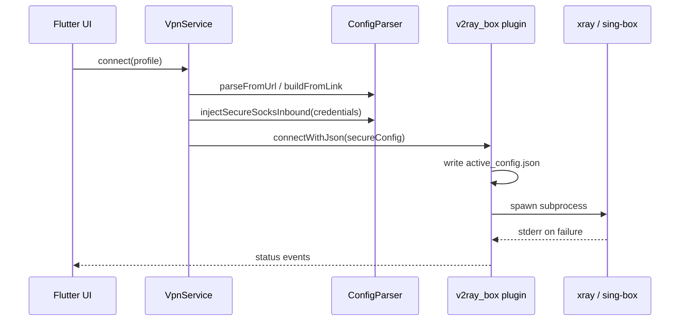

# Architecture

## High-level flow



## Flutter app (`secure_vpn_client`)

### State management

- **Riverpod** — `vpn_providers.dart`
  - `vpnServiceProvider`, `engineProvider`, `profilesProvider`, `selectedProfileProvider`
  - Profiles persisted via `shared_preferences`

### Security layer (Dart)

1. **`CredentialService`** — CSPRNG username/password per session (`crypto_utils.dart`).
2. **`ConfigParser.injectSecureSocksInbound()`** — removes unsafe SOCKS inbounds, adds authenticated SOCKS on `127.0.0.1:1080`, validates config.
3. **`ConfigParser` subscription handling** — User-Agent selection, decoy skipping, v2rayNG JSON array parsing, sing-box DNS migration, proxy-only inbound stripping on desktop.
4. **`LinkConfigBuilder`** — builds minimal xray/sing-box JSON from share links (`vless://`, `vmess://`, `trojan://`, `ss://`).

### VpnService

- `initialize()` — sets `VpnMode.proxy` on desktop, `enableTun: false` in `ConfigOptions`.
- `resolveProfileConfig()` — subscription URL → normalized link or JSON; config link → `LinkConfigBuilder`.
- `connect()` — inject secure inbound → `checkConfigJson` → set credentials channel → `connectWithJson`.

## v2ray_box fork (`packages/v2ray_box`)

Path dependency in `secure_vpn_client/pubspec.yaml`:

```yaml
v2ray_box:
  path: ../packages/v2ray_box
```

### Linux desktop plugin

| File | Role |
|------|------|
| `linux/v2ray_box_plugin.cc` | Method channel `v2ray_box`, credentials channel `secure_vpn/credentials` |
| `linux/desktop_core.cc` | FindBinary, Start/Stop subprocess, geo asset copy, stderr capture |
| `linux/desktop_core.h` | Shared helpers (paths, WriteTextFile, EnsureXrayGeoAssets) |

**Runtime paths:**

- Working dir: `~/.local/share/v2ray_box/`
- Active config: `~/.local/share/v2ray_box/profiles/active_config.json`
- Xray geo assets: `~/.local/share/v2ray_box/assets/{geoip,geosite}.dat`
- Bundled cores: `{app_bundle}/lib/resources/{xray,sing-box}`

**Environment variables (child process):**

- `XRAY_LOCATION_ASSET` → assets dir
- `SECURE_VPN_SOCKS_USER`, `SECURE_VPN_SOCKS_PASS`, `SECURE_VPN_SOCKS_PORT`

### Android / iOS / macOS

Fork includes secure credential plugins and config builders. Android uses `VpnService` / `BoxService`; iOS/macOS use Swift `ConfigBuilder` + process wrappers.

## Config formats

### Xray (subscription via v2rayNG UA)

Server returns JSON **array** of configs. First real entry has `vless`/`vmess`/`trojan` outbound. Routing may use `geosite:` / `geoip:` rules → requires geo `.dat` files.

Placeholder `outboundTag: "proxy"` is rewritten to the actual outbound tag in `ConfigParser`.

### sing-box (subscription via `sing-box` UA)

Server returns base64-encoded **link list**. First non-decoy `vless://` link is parsed by `LinkConfigBuilder`.

### Hiddify JSON (avoid on desktop)

Default Dart `http` User-Agent (`Dart/x.x (dart:io)`) may return full sing-box JSON with `tun-in`, legacy DNS — **do not use**; always set explicit UA in `parseFromUrl`.

## Security model

```
[Apps on device] --X--> 127.0.0.1:1080 (auth required)
                              ^
                              | SOCKS (session creds)
[Flutter app] --> [xray/sing-box] --> [remote proxy outbound]
```

Vulnerable pattern we avoid:

```
[Any app on LAN/localhost] --> 0.0.0.0:7890 (no auth)  # CVE-class issue, March 2026
```
